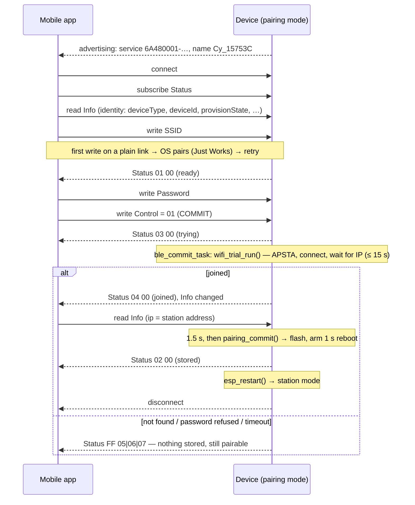

# Wi-Fi pairing over BLE

How a factory-fresh (or reset) device learns the router's SSID and password
from the mobile app **without the phone leaving its own network**. While the
device is in pairing mode it advertises a BLE GATT service; the app finds it
by service UUID, connects, writes the SSID and password into two
characteristics and sends a *commit* — the device **tries the credentials
first** (APSTA), reports the router-assigned IP, then stores them in flash
and reboots into station mode. A wrong password is reported back instead of
stranding the device.

> **Per-channel config (2026-09):** the 128-bit base UUID is a runtime value now — `cy_ble_base_uuid128` (`device_config/cy_config.h`), filled into each service by `ble_uuid128_from_base()`. A channel created in the app draws its own, so one channel's scan no longer lists another's pairable units. `BLE_PAIRING_UUID128_BYTES` remains only as the weak default.

This runs **beside** the soft-AP/TCP flow in [pairing.md](pairing.md), not
instead of it: both are up whenever the device is pairable, both end in the
same `pairing_commit()`, and the app may use either. Code:
[src/ble/ble_pairing.c](../src/ble/ble_pairing.c) (GATT server, advertising,
security), [ble_pairing.h](../src/ble/ble_pairing.h) (the protocol
constants), [ble_config.h](../src/ble/ble_config.h) (UUIDs, name prefix,
tunables) and [src/wifi/wifi_trial.c](../src/wifi/wifi_trial.c) (the
credential trial).

## When the device advertises

`cything_begin()` ([cything.c](../src/cything.c)) reads the stored Wi-Fi mode
at boot:

| Stored mode | Bluetooth |
|---|---|
| station (`"WiMStA"`) | never started — `ble_release_memory()` hands the controller + host RAM (~60 KB on ESP32) back to the heap |
| anything else (first boot, or after the five-power-cycle reset) | `ble_pairing_start()` — advertising until a commit succeeds; the soft-AP and TCP/UDP servers start as before |

Advertising stops while a phone is connected (one connection at a time) and
resumes on disconnect. After a successful commit it is not resumed — the
device reboots one second later.

## Finding the device

| | |
|---|---|
| Advertising packet | flags + the **128-bit pairing service UUID** `6A480001-DC02-4C78-A1A3-64193A12E418` |
| Scan response | the local name `Cy_` + the unit's 6-hex-digit suffix, e.g. `Cy_15753C` — the **same suffix as the soft-AP SSID** `Cy_WiFi_15753C`, so the app can show which unit it is talking to |
| Interval | 100–200 ms (`BLE_PAIRING_ADV_INTERVAL_*_MS`) |

Filter the scan on the service UUID (iOS: `scanForPeripherals(withServices:)`,
Android: `ScanFilter.setServiceUuid`). The UUID is in the advertising packet
itself, not the scan response, because iOS only matches on the former. The
name is per unit; the UUIDs are per product and identical in every device.

## GATT

Base UUID `6A48xxxx-DC02-4C78-A1A3-64193A12E418`; `xxxx` is the id below.

### Pairing service — `6A480001-…`

| Characteristic | id | Properties | Value |
|---|---|---|---|
| SSID | `0002` | write | 1–32 bytes, UTF-8, no NUL |
| Password | `0003` | write | 0–64 bytes; empty for an open network |
| Control | `0004` | write | 1 byte: `0x01` = **COMMIT** |
| Status | `0005` | read, notify | 2 bytes `[state, detail]` (below) |
| Info | `0006` | read, notify | the **GET_INFO scan CSV** ([udp-discovery.md](udp-discovery.md)): `ip,sourceTerminalId,deviceName,deviceType,deviceId,provisionState,fw,hw,caps`. Identity fields are valid any time; `ip` is the router-assigned station address once Status is `04` (before that, the soft-AP's `192.168.4.1`). ~100–200 bytes: **read** it (ATT long read) — the notify is only a "changed" hint and truncates at MTU−3 |

Writes longer than the MTU allows arrive as ATT long writes
(prepare/execute); NimBLE reassembles them, so the app just writes the value.
An out-of-range length is rejected with *Invalid Attribute Value Length*.

With `BLE_PAIRING_REQUIRE_ENCRYPTION` (default 1) the three writable
characteristics require an **encrypted link**. The first write on a plain
link fails with *Insufficient Encryption* and the phone OS pairs
automatically — LE Secure Connections *Just Works*, no PIN — then retries.
The user sees one pairing dialog. There is **no bonding**: a device that is
re-flashed or reset never conflicts with a bond the phone still holds (and if
a phone insists it is bonded, the device drops its side and re-pairs —
`BLE_GAP_EVENT_REPEAT_PAIRING`).

### Status

| byte 0 | | byte 1 |
|---|---|---|
| `0x00` | idle — no SSID yet | 0 |
| `0x01` | ready — SSID received, waiting for COMMIT | 0 |
| `0x03` | trying — COMMIT accepted, connecting the station to the router | 0 |
| `0x04` | **joined** — the router handed out an IP; **read Info now** | 0 |
| `0x02` | stored — credentials in flash, **rebooting in 1 s** | 0 |
| `0xFF` | error | `0x01` no SSID · `0x02` flash write failed · `0x03` unknown opcode · `0x04` commit already running · `0x05` **Wi-Fi network not found** · `0x06` **password refused** · `0x07` **no IP within 15 s** — for 05/06/07 nothing was stored and the device stays pairable |

Subscribe to Status before writing; every change is notified. The reboot is
armed *before* the `0x02` notify is sent, so the app should treat the
disconnect that follows as expected.

### Trying the credentials

On COMMIT the `ble_commit` task runs `wifi_trial_run()`
([wifi_trial.c](../src/wifi/wifi_trial.c)): the Wi-Fi driver switches to
**APSTA** — the soft-AP stays up for a phone on the TCP path — a station
interface is created beside it and connected with the received credentials,
and the task waits up to `BLE_PAIRING_WIFI_TRIAL_TIMEOUT_MS` (15 s) for
`IP_EVENT_STA_GOT_IP`. Disconnect reasons decide the outcome: `NO_AP_FOUND*`
→ `05`; `AUTH_EXPIRE` / `AUTH_FAIL` / `4WAY_HANDSHAKE_TIMEOUT` /
`HANDSHAKE_TIMEOUT` / `MIC_FAILURE` → `06`; anything else gets two
reconnects inside the timeout, then `07`. On failure the station is dropped,
the mode goes back to AP and `device_ip` is the soft-AP address again.

On success `device_ip` becomes the station address, Info is marked changed
(notify hint), Status goes `04`, and the task sleeps **1.5 s** so the phone's
read of Info completes before `pairing_commit()` writes flash and arms the
1 s reboot (`02`). The station is left connected — the reboot tears it down.
The router will normally hand the same address to the same MAC on the next
lease, which is what the app connects to first; its multicast scan remains
the fallback.

### Device Information service — `0x180A` (SIG)

| Characteristic | UUID | Value |
|---|---|---|
| Model Number | `0x2A24` | `DEVICE_TYPE` |
| Firmware Revision | `0x2A26` | `FIRMWARE_VERSION` |
| Hardware Revision | `0x2A27` | `HARDWARE_VERSION` |

The same three fields the UDP `GET_INFO` scan reports
([udp-discovery.md](udp-discovery.md)), for an app that wants to check the
firmware before pairing.

## Sequence



## Implementation notes

**NimBLE, not Bluedroid.** Both hosts are in ESP-IDF; under Arduino the
core's precompiled Bluedroid is the full dual-mode build and adds ~700 KB to
the image (it no longer fits a 1.5 MB OTA slot), while NimBLE adds ~250 KB.
NimBLE's C API is also what the [NimBLE-Arduino](https://github.com/h2zero/NimBLE-Arduino)
library exposes (it bundles the same host source), so one `ble_pairing.c`
serves both builds. Differences are confined to `#ifdef ARDUINO`: header
paths (NimBLE-Arduino keeps them under `nimble/…`), and the controller
bring-up (`nimble_port_init()` does it on IDF, the caller does under
Arduino — the same split NimBLE-Arduino's own `NimBLEDevice::init` has).

**Build plumbing.** IDF: `CONFIG_BT_ENABLED` / `CONFIG_BT_NIMBLE_ENABLED`,
BLE-only controller, peripheral role only, one connection
([sdkconfig.defaults](../sdkconfig.defaults)); `bt` in the component's
`REQUIRES`. Arduino/PlatformIO: `NimBLE-Arduino >= 2.5.1` is declared as a
dependency in `library.properties` / `library.json`, so it is pulled in
automatically; nothing to add to the sketch. `bleInUse()` is defined strong
in `ble_pairing.c` so the Arduino core does not free the BLE controller RAM
before `setup()`.

**Tasks.** NimBLE runs its host on its own task (`nimble_host`, 4 KB); every
GATT/GAP callback runs there. COMMIT hands the Wi-Fi trial and the flash
write to a one-shot `ble_commit` task ([task_config.h](../src/common/task_config.h)
`BLE_COMMIT_TASK_*`) so the host task never blocks on the 15 s wait or the
partition erase — see [tasks.md](tasks.md). The Info read formats the CSV
into a static buffer, not the host task's stack.

**Shared end.** `pairing_commit(ssid, password)` in
[tcp_server/pairing.c](../src/tcp_server/pairing.c) writes the `wifi_info`
partition and arms `reboot_after_ms(1000)`; the TCP `FinishP` step calls the
same function. TCP and BLE keep separate credential buffers, so a half-done
TCP attempt does not leak into a BLE commit or vice versa.

**Memory.** ESP32 IDF build: +220 KB flash over the pre-BLE image (1.18 MB
in a 1.5 MB slot); static DRAM 88 KB, IRAM 118 KB of 128 KB. Arduino 4 MB
env: 1.25 MB of 1.5 MB. The controller's ~56 KB DRAM reservation is released
to the heap in station mode. The old unused 32 KB `aws_iot_command_buffer`
was removed in the same change — without that the Arduino link overflowed
static DRAM.

## Trying it by hand

- **nRF Connect** (Android/iOS) or **LightBlue** (iOS): scan, open
  `Cy_xxxxxx`, enable notifications on `…0005`, write the SSID as text to
  `…0002`, the password to `…0003`, then byte `01` to `…0004`. Accept the
  pairing dialog on the first write.
- From this Mac, with the same protocol the app uses:

```bash
pip install bleak
scripts/ble_pair.py --scan
scripts/ble_pair.py Cy_15753C MyRouter hunter2
```

Expected: `status: 0100 ready` after the SSID, then `0300 trying`,
`0400 joined` with `info: 192.168.1.57,…` after the commit, `0200 stored`,
and the connection drops as the device reboots; the monitor shows
`ssid <- "MyRouter"`, `commit: …`, `trial: got ip …`, `status -> 0x04/0x00`,
`status -> 0x02/0x00` under `BLE_DB` / `WIFI_STA_DB`
([cy_log.h](../src/common/cy_log.h)). With a wrong password:
`status: ff06 error: Wi-Fi password refused` and the device keeps advertising.

## Limits and caveats

- **The TCP path still commits blind.** Only BLE COMMIT tries the
  credentials first; `FinishP` over the soft-AP stores them unchecked as
  before ([pairing.md](pairing.md)).
- **APSTA moves the soft-AP to the router's channel** while the station
  associates; a phone on the soft-AP at that moment may drop and rejoin.
- **One connection at a time.** `CONFIG_BT_NIMBLE_MAX_CONNECTIONS=1`; a
  second phone sees the device stop advertising while the first is connected.
- **Just Works is not authenticated.** It stops passive sniffing of the
  password, not an attacker who is in range *during* the pairing window and
  connects first. Same exposure level as the soft-AP with its fixed
  password; a passkey would need a display or a printed code on the device.
- **SSID ≤ 32 / password ≤ 64 bytes**, enforced (an ATT error, not silent
  truncation as on the TCP path).

## File map

| File | Role |
|---|---|
| [src/ble/ble_pairing.c](../src/ble/ble_pairing.c) | GATT table, access callback, advertising, security, host bring-up, `ble_commit` task |
| [src/ble/ble_pairing.h](../src/ble/ble_pairing.h) | `ble_pairing_start()`, `ble_release_memory()`, the Status / Control constants |
| [src/ble/ble_config.h](../src/ble/ble_config.h) | base UUID + ids, name prefix, `BLE_PAIRING_REQUIRE_ENCRYPTION`, advertising interval, trial timeout |
| [src/wifi/wifi_trial.c](../src/wifi/wifi_trial.c) | `wifi_trial_run()` — APSTA credential trial, disconnect-reason classification |
| [src/udp_socket/udp_response_handler.c](../src/udp_socket/udp_response_handler.c) | `udp_get_info_response()` — the CSV the Info characteristic serves |
| [src/tcp_server/pairing.c](../src/tcp_server/pairing.c) | `pairing_commit()` — the shared flash-and-reboot step |
| [src/wifi/wifi_info_handler.c](../src/wifi/wifi_info_handler.c) | `wifi_get_unit_suffix()` — the per-unit part of both the BLE name and the AP SSID |
| [src/cything.c](../src/cything.c) | starts BLE in pairing mode, releases its RAM in station mode |
| [scripts/ble_pair.py](../scripts/ble_pair.py) | pair from a computer (bleak) |
| [doc/pairing.md](pairing.md) | the soft-AP/TCP flow this runs beside |
