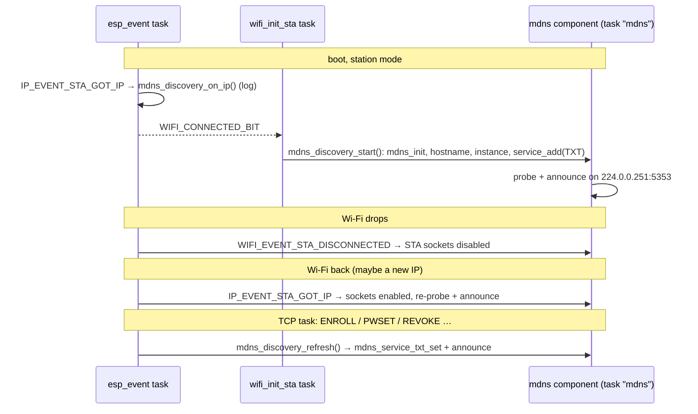

# mDNS / DNS-SD discovery (`_cything._tcp`)

In station mode the device advertises itself over **mDNS / DNS-SD**
(Bonjour). The phone apps find devices with the platform's own browser —
Android `NsdManager`, iOS `NWBrowser` — and then send a unicast `GET_INFO` to
the resolved address ([udp-discovery.md](udp-discovery.md)). This replaced
the custom multicast scan (a `GET_INFO` datagram to `232.10.11.12`), which
the firmware no longer answers:

- **iOS** can browse a Bonjour type listed in `Info.plist` without the
  multicast-networking entitlement that a raw multicast socket needs.
- **Across access points** mDNS does better than our custom group: routers,
  mesh systems and IGMP-snooping switches know `224.0.0.251:5353` and often
  forward or proxy it (Bonjour gateways, mDNS reflectors), where an unknown
  group like `232.10.11.12` is dropped.

All code is in [src/mdns/](../src/mdns/); the responder itself is the
`espressif/mdns` component.

## The service

| | Value | Where |
|---|---|---|
| Service type | **`_cything._tcp`** | `MDNS_SERVICE_TYPE` / `MDNS_SERVICE_PROTO`, [mdns_discovery.c](../src/mdns/mdns_discovery.c) — a library constant |
| Port (SRV) | `cy_tcp_port` (default `1234`) — the local TCP command server ([tcp-server.md](tcp-server.md)) | channel network spec |
| Host name | `cything-<unit suffix>` → `cything-a1b2c3.local` | lower-case eFuse-MAC suffix, same 6 hex digits as the soft-AP SSID `Cy_WiFi_A1B2C3` |
| Instance name | `Cything A1B2C3 #<tag>`, or `Cything A1B2C3` when the tag is empty | `MDNS_INSTANCE_PREFIX` + unit suffix + channel tag |
| TXT | see below | rebuilt on every state change |

Host and instance names are unique per unit because they carry the MAC
suffix. If two units ever collide (the suffix is 3 bytes), the mdns probe
step renames the loser by appending a number; the app must therefore identify a device by TXT `id=` / the `GET_INFO` reply, not
by parsing the instance name.

### Why the service type is fixed

iOS only lets an app browse Bonjour types it declared at build time in
`Info.plist` (`NSBonjourServices`). A per-channel type (`_ch-xyz._tcp`) would
need a new app build for every channel. So there is **one** type for every
CyThing device, forever; channels are told apart by a tag in TXT (and in the
instance name). The type is deliberately not in the channel network spec —
changing it is a breaking protocol change for both apps.

## TXT record

Mirrors the non-secret part of the `GET_INFO` reply. Keys and values are kept
short; one record is ~80 bytes.

| Key | Value | Source | Example |
|---|---|---|---|
| `id` | provisioned `deviceId`; **empty until provisioned** | `g_prov_device_id` via `provisioning_get_scan_fields()` | `dev_01J…` |
| `ch` | channel tag; empty if the sketch sets none | `cy_mdns_channel_tag` | `k3x9a2mf` |
| `v` | firmware version | `cy_firmware_version` (= `FIRMWARE_VERSION` unless overridden) | `1.2.1` |
| `type` | device type (lower-case) | `cy_device_type` | `devtype1` |
| `paired` | `1` if at least one account is in the paired list (the device has an owner), else `0` | `paired_list_count() > 0` | `1` |
| `pw` | `1` if a device password is set, `0` while open to all (`nopw` in `GET_INFO`) | `device_password_is_set()` | `1` |
| `prov` | `1` once the CSR handshake has completed (`claimed`), `0` while `unprovisioned` | `provisioning_is_active()` | `1` |

**Nothing secret goes into TXT** — no password, verifier, key, token or
account email. Anyone on the Wi-Fi can read it, exactly like the `GET_INFO`
reply. `sourceTerminalId` is not in TXT either; the app still gets it (and
the IP-level identity check) from `GET_INFO`.

The record is re-announced whenever a field can change without a reboot:

| Event | Call site |
|---|---|
| owner / user paired (`ENROLL`) | `paired_list_add()` |
| account unpaired (`REVOKE`, `UNPAIR`) | `paired_list_remove()` |
| password set / changed | `device_password_set()` |
| password cleared, factory reset | `device_password_clear()`, `paired_list_clear()` |

Provisioning (`PFIN`) and Wi-Fi pairing both reboot the device, so the
record is built fresh on the next start. The 5× power-cycle factory reset
clears the lists and reboots into soft-AP mode, where mDNS does not run.

## Channel tag and filtering

The tag is a short id (~8 chars, `[a-z0-9]`) that the phone app derives from
the channel id and writes into the generated sketch:

```c
/* cything_network_spec.h */
#define CYTHING_MDNS_CHANNEL_TAG    "k3x9a2mf"

/* cything_config.ino / cything_config.cpp — guarded so an older spec builds */
#ifdef CYTHING_MDNS_CHANNEL_TAG
const char     cy_mdns_channel_tag[]   = CYTHING_MDNS_CHANNEL_TAG;
#endif
```

Without it the weak default `cy_mdns_channel_tag[] = ""`
([cy_config.c](../src/device_config/cy_config.c), `MDNS_CHANNEL_TAG` in
[device_config.h](../src/device_config/device_config.h)) applies — the same
pattern as `cy_udp_port`. The boot line `config: … mdns_tag='…'` shows
which one won. The firmware cuts a tag longer than 16 characters and warns
about characters outside `[a-z0-9]`, but otherwise uses it as given.

The app browses `_cything._tcp` and keeps only instances whose tag matches
the channel:

1. **From the instance name** — `… #<tag>`, available straight from the
   browse result with no resolve. On Android 12–13 `NsdManager` resolves one
   service at a time, so skipping foreign channels *before* resolving matters.
2. **From TXT `ch=`** — authoritative, after resolving (always on iOS 14+ /
   Android 14+ where TXT arrives with the result).

The tag is a filter, not a security boundary: it is public, and the app
still runs its normal identity check (`GET_INFO` / `sourceTerminalId`,
pairing handshake) before listing or controlling a device.

### Compile-time tag vs. the device's own channel id

The device does know a channel at runtime: `g_prov_source_terminal_id`, the
**root** channel id stored by the CSR handshake (and updated in place by a
cross-family re-pair `PROV:`+`PFIN`, without a reboot). It is **not** used for
the tag, for now:

- it is empty until the device is provisioned — exactly the window in which
  the "add a device" flow needs discovery most — while the compile-time tag is
  there from the first boot;
- the app would have to hash the same root id with the same algorithm, i.e.
  the tag derivation becomes a firmware↔app protocol, and every fork of a
  channel would have to resolve to its root before filtering;
- `sourceTerminalId` is already public via `GET_INFO`, so hashing it adds no
  privacy — it only saves one define.

A possible later step is a fallback: compile-time tag if set, else a tag
derived from `sourceTerminalId`. Decision pending with the app side.

## Lifecycle



- **Start once.** `mdns_discovery_start()` runs in `wifi_init_sta` right
  after `WIFI_CONNECTED_BIT`, i.e. after the first `IP_EVENT_STA_GOT_IP`. Not
  in the event handler: the esp_event task has a 2304-byte stack, too small
  for `mdns_init()`. It is idempotent and never torn down.
- **Disconnect / reconnect** is handled by the component itself: with
  `CONFIG_MDNS_PREDEF_NETIF_STA` it registers its own `WIFI_EVENT` /
  `IP_EVENT` handlers for the default station netif. On
  `WIFI_EVENT_STA_DISCONNECTED` it closes the STA sockets (nothing is ever
  announced with a stale address); on `IP_EVENT_STA_GOT_IP` it reopens them
  and probes/announces with the new address. No `mdns_free()` / `mdns_init()`
  per cycle, so repeated drops cannot leak or race.
  `mdns_discovery_on_ip()` / `_on_ip_lost()` only log.
- **State changes** call `mdns_discovery_refresh()` from whichever task made
  them (a TCP client task, `main` during a reset). It takes its own mutex,
  reads the state, and hands the record to `mdns_service_txt_set()`, which
  is thread-safe and re-announces. It must not be called with the
  paired-list or password lock held — the mutators call it after releasing.
- **Soft-AP (pairing) mode**: not started. The AP address is fixed
  (`192.168.4.1`) and `CONFIG_MDNS_PREDEF_NETIF_AP` is off.
- **Static-IP build** (`ENABLE_WIFI_STATIC_IP`): same, the component reacts to
  `WIFI_EVENT_STA_CONNECTED` when DHCP is stopped.
- If `mdns_init()` or `mdns_service_add()` fails (out of memory) it is logged
  and the device can then only be found by the BLE scan beacon or by
  its IP.

`DISCOVERYMODE` ([ble-scan-beacon.md](ble-scan-beacon.md)) does not switch
mDNS off: like the UDP server it is always on in station mode; the mode only
gates the BLE beacon.

## mDNS and the UDP `GET_INFO` reply

mDNS says where the device is; the unicast `GET_INFO` reply is what the app
trusts and lists:

| | UDP `GET_INFO` | mDNS |
|---|---|---|
| Transport | unicast to the device on `cy_udp_port`, unicast CSV reply | `224.0.0.251:5353`, standard DNS-SD |
| Channel-specific | port and token come from the network spec | fixed type; tag in TXT / instance name |
| Carries | IP, `sourceTerminalId`, name, type, `deviceId`, provision state, versions, caps | host/IP, port, `id`, `ch`, `v`, `type`, `paired`, `pw`, `prov` |

The multicast groups the UDP server used to join (`232.10.11.12`,
`FF02::FC`) are gone; app builds from before mDNS, which only sent the
multicast scan, no longer find the device.

## Configuration and cost

`sdkconfig.defaults` (ESP-IDF build):

| Option | Value | Why |
|---|---|---|
| `CONFIG_MDNS_PREDEF_NETIF_STA` | `y` | the component follows the station's IP events itself; `mdns_discovery_start()` refuses to start without it |
| `CONFIG_MDNS_PREDEF_NETIF_AP` / `_ETH` | off | never advertise on the soft-AP; no Ethernet |
| `CONFIG_MDNS_ENABLE_CONSOLE_CLI` | off | no `console` commands linked in |
| `CONFIG_MDNS_ENABLE_BROWSE` | off | the device only answers, never browses |
| `CONFIG_MDNS_MAX_SERVICES` | `4` | one is ours; room for an application's own |
| `CONFIG_MDNS_TASK_PRIORITY` / `_AFFINITY` / `_STACK_SIZE` | `1` / CPU0 / 4096 (defaults) | below every CyThing task (5) so it never delays local TCP control; above only `aws_iot_task` (0). Pinned to CPU0 with the Wi-Fi driver; the task wakes on its 100 ms timer and on packets and does very little each time |

Under Arduino / PlatformIO (`framework = arduino`) nothing is configured:
arduino-esp32 3.3.x ships `espressif/mdns` 1.11.3 precompiled (headers in the
framework, `-lespressif__mdns` in its link line) with the same task
defaults, STA predefined, and console/browse compiled in but unused. No
change to `library.json` / `library.properties` is needed.

Under ESP-IDF the dependency is declared in
[components/cything/idf_component.yml](../components/cything/idf_component.yml)
(`espressif/mdns: ^1.11.3`) and the component `REQUIRES mdns`; the component
manager downloads it into `managed_components/` (git-ignored, as is
`dependencies.lock`). Resolved today: 1.13.1.

Measured build cost (ESP32, 4 MB table, 2026-09-29):

| Build | Image / flash | Static DRAM | IRAM |
|---|---|---|---|
| IDF 6.0.2 (`build/`) | 1 218 508 → 1 252 696 B (**+34.2 KB**) | +2 088 B | ±0 |
| IDF 5.5.5 (`build-5.5/`) | 1 210 193 → 1 244 209 B (**+34.0 KB**) | +2 088 B | ±0 |
| PlatformIO `esp32-4mb` | 1 295 603 → 1 331 431 B (+35.8 KB, 84.7 % of the 1.5 MB slot) | +2 440 B | — |

At runtime add the `mdns` task stack (4 KB) plus the component's heap
(sockets, service/TXT records, packet buffers) — see the bench figure below.
IRAM is tight on the IDF 5.5 / Arduino build (~650 B free): anything added
here must stay out of IRAM, which is why there is no stack high-water log for
the `mdns` task (`xTaskGetHandle()` alone costs ~300 B of IRAM).

## Trying it

From a Mac on the same Wi-Fi as a device in station mode:

```bash
# browse: one line per device
dns-sd -B _cything._tcp

# resolve one instance: host, port, TXT
dns-sd -L "Cything A1B2C3 #bench01" _cything._tcp

# host name → address
dns-sd -G v4 cything-a1b2c3.local
```

Expected `-L` output:

```
Cything\032A1B2C3\032#bench01._cything._tcp.local. can be reached at cything-a1b2c3.local.:1234 (interface 14)
 id=dev_… ch=bench01 v=1.2.1 type=devtype1 paired=1 pw=1 prov=1
```

Linux: `avahi-browse -rt _cything._tcp`. Android: any "Service Browser" app.

On the device monitor:

```
config: tcp=1234 udp=1234 … mdns_tag='bench01'
mdns: advertising 'Cything A1B2C3 #bench01' _cything._tcp port 1234 on cything-a1b2c3.local
mdns: txt id=… ch=bench01 v=… type=devtype1 paired=1 pw=1 prov=1
```

Checks worth repeating after a change:

- **TXT update** — keep `dns-sd -L …` running, pair a phone / set or clear
  the password: a new TXT line appears within a second
  (`mdns: txt updated …` on the monitor).
- **Wi-Fi drop** — power the AP off: the instance disappears from
  `dns-sd -B` (its goodbye or TTL). Power it back: it re-appears, `-L`
  resolves to the (possibly new) address, `mdns: station up` on the monitor.
  Repeat a few times; free heap should not drift.
- **UDP still works** — `echo -n GET_INFO | nc -u -w 1 <resolved-ip> 1234`.

## File map

| File | Role |
|---|---|
| [src/mdns/mdns_discovery.c](../src/mdns/mdns_discovery.c) / [.h](../src/mdns/mdns_discovery.h) | start, TXT build/refresh, IP-event hooks |
| [src/device_config/cy_config.c](../src/device_config/cy_config.c) / [.h](../src/device_config/cy_config.h) | `cy_mdns_channel_tag` weak default |
| [src/device_config/device_config.h](../src/device_config/device_config.h) | `MDNS_CHANNEL_TAG` (`""`) |
| [src/wifi/station_mode.c](../src/wifi/station_mode.c) | start after `WIFI_CONNECTED_BIT`; IP-event hooks |
| [src/security/paired_list.c](../src/security/paired_list.c), [device_password.c](../src/security/device_password.c) | `mdns_discovery_refresh()` after each mutation |
| [src/cything.c](../src/cything.c) | `mdns_discovery_init()` |
| [components/cything/idf_component.yml](../components/cything/idf_component.yml), [CMakeLists.txt](../components/cything/CMakeLists.txt) | `espressif/mdns` dependency |
| [sdkconfig.defaults](../sdkconfig.defaults) | the `CONFIG_MDNS_*` block above |
| [examples/Basic/cything_network_spec.h](../examples/Basic/cything_network_spec.h), `cything_config.ino`, [main/cything_config.cpp.example](../main/cything_config.cpp.example) | `CYTHING_MDNS_CHANNEL_TAG` → `cy_mdns_channel_tag` |
