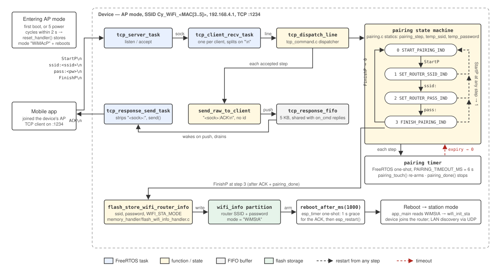
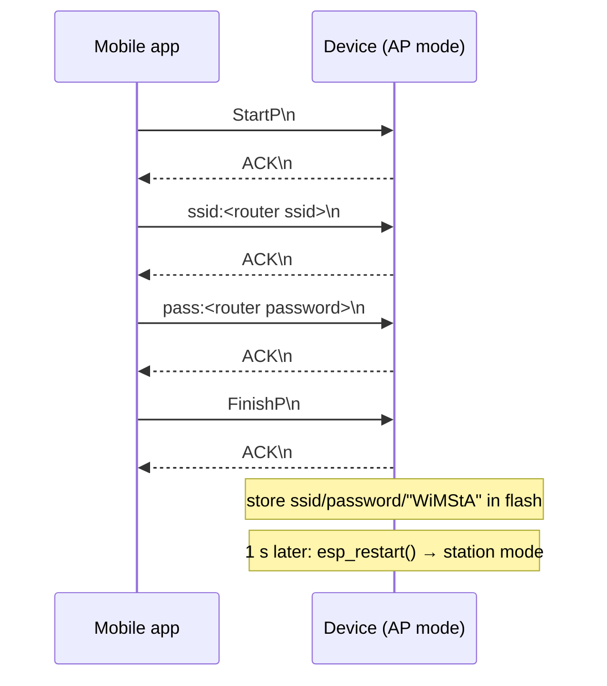
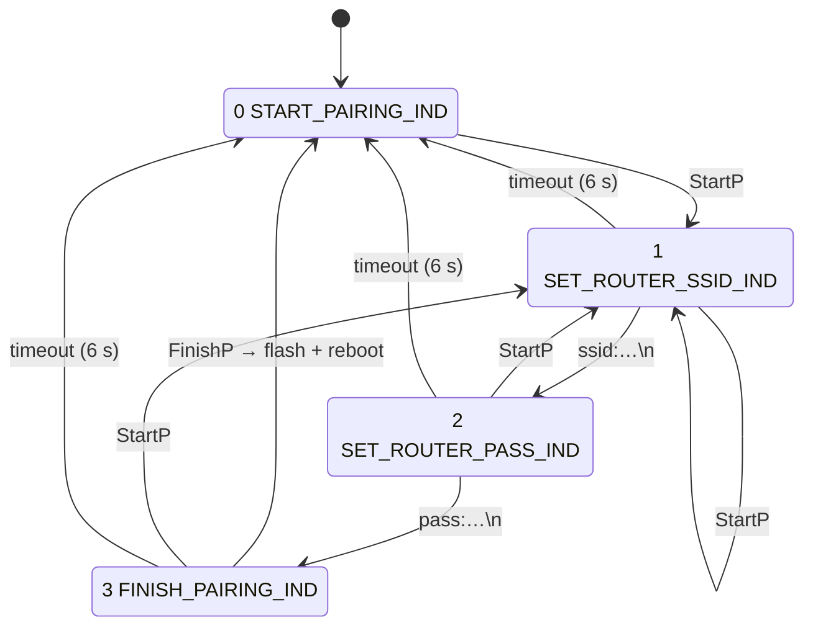

# Wi-Fi pairing

How a factory-fresh (or reset) device learns the router's SSID and password
from the mobile app over the soft-AP. Pairing is a four-line, line-oriented
TCP exchange with the device while it is running as a Wi-Fi access point; on
success the device stores the credentials in flash and reboots into station
mode. The same device is pairable over BLE at the same time
([ble-pairing.md](ble-pairing.md)); both paths end in `pairing_commit()`.

All pairing code lives in [src/tcp_server/pairing.c](../src/tcp_server/pairing.c)
(state machine, timer, validation, protocol strings) with a two-function
interface in [pairing.h](../src/tcp_server/pairing.h): `pairing_timer_init()`
and `pairing_handle_line(line, sock)`. Pairing is **TCP-only** — the UDP server on
the same port only answers `GET_INFO` discovery scans ([udp-discovery.md](udp-discovery.md)).



## When the device is pairable

`cything_begin()` reads the `wifi_info` partition at boot
([cything.c](../src/cything.c)):

| Stored mode | Boot path |
|---|---|
| `"WiMStA"` (station) | `wifi_init_sta` with the stored SSID/password; TCP+UDP servers start once the device has an IP |
| anything else (first boot, or `"WiMAcP"`) | `wifi_init_accesspoint_mode()` — the device is an AP named `ESP_AP_WIFI_SSID_PREFIX` + the last three bytes of its eFuse MAC (e.g. `Cy_WiFi_15753C`, unique per unit) with password `ESP_AP_WIFI_PASS` ([wifi/wifi_config.h](../src/wifi/wifi_config.h)), IP `192.168.4.1`; TCP and UDP servers start immediately |

To get a paired device back into AP mode, power-cycle it **five times within
~2 s of boot**: [`reset_handler()`](../src/common/reset_handler.c) counts boots in
flash, and on the fifth writes mode `"WiMAcP"` and restarts.

The mobile app then joins the device's AP and opens a TCP connection to
`192.168.4.1:1234` (`TCP_PORT`).

## Protocol

Every request is one line ending in `\n`. Every accepted step is answered
with `ACK\n`. The `ssid:`/`pass:` prefixes are in
[device_config/device_config.h](../src/device_config/device_config.h); `StartP`/`FinishP`/`ACK` are private to
`pairing.c`.



| # | Line | Accepted when `pairing_step` is | Effect |
|---|---|---|---|
| 1 | `StartP` | **any** | `pairing_step = 1`, timer armed |
| 2 | `ssid:<ssid>\n` | `1 SET_ROUTER_SSID_IND` | SSID copied to `temp_ssid` (max 127 bytes), `pairing_step = 2`, timer re-armed |
| 3 | `pass:<password>\n` | `2 SET_ROUTER_PASS_IND` | password copied to `temp_password` (max 127 bytes), `pairing_step = 3`, timer re-armed |
| 4 | `FinishP` | `3 FINISH_PAIRING_IND` | `pairing_commit(ssid, password)` (flash + `reboot_after_ms(1000)`), `pairing_step = 0`, timer stopped, `ACK` |

A line for the wrong step is **ignored with no reply** — the app should
treat a missing `ACK` as "start over with `StartP`".

`ssid:` / `pass:` lines are matched by `is_pairing_command_valid()`
([pairing.c](../src/tcp_server/pairing.c)): the line must start with the full
prefix and end with the `\n` suffix. Lines reach `tcp_dispatch_line` with
their trailing `\n` still attached, so the suffix check is real.

### Ordering with other commands

`tcp_dispatch_line` checks provisioning prefixes (`PROV:`, `CSRREQ`, …) and
the OTA handshake (`startupdatecomm`, …) *before* the pairing prefixes; none
of them collide. Local commands (`on_cmd` / `off_cmd`) are checked after.
See [tcp-server.md](tcp-server.md#step-32-command-dispatch).

## State machine



State is four file-statics in `pairing.c`: `pairing_step`, `temp_ssid`,
`temp_password` and their lengths. There is one state machine for the whole
device, not one per TCP connection — a second client sending `StartP`
mid-flow restarts the first client's attempt.

### Inactivity timeout

A single FreeRTOS one-shot software timer (`pairing_timer`, created by
`pairing_timer_init()` from `cything_begin()`) guards the flow:

| Call | When | Effect |
|---|---|---|
| `pairing_touch()` | after every accepted `StartP` / `ssid:` / `pass:` | `xTimerReset` — restarts the `PAIRING_TIMEOUT_MS` (6 s) countdown |
| `pairing_done()` | on accepted `FinishP` | `xTimerStop` |
| `pairing_timeout_cb` | timer expires | logs `pairing timed out at step N` and sets `pairing_step = 0` |

The callback runs in the FreeRTOS timer-service task and only writes an
`int`. `PAIRING_TIMEOUT_MS` is 6 s ([wifi/wifi_config.h](../src/wifi/wifi_config.h)) —
the gap between *consecutive steps*, not the whole flow, so it only needs to
cover the app's turnaround between one `ACK` and the next line, not a
person typing.

Because `StartP` is accepted at any step, the app never has to *wait* for the
timeout — the timer only exists so an abandoned attempt can't leave the
device stuck at step 2 or 3 forever.

## Replies

Each `ACK` goes through the same path as every other TCP reply
([send-buffers.md](send-buffers.md)):

1. `send_raw_to_client(sock, "ACK")` pushes `"<sock>:ACK\n"` into
   `tcp_response_fifo` — no response id, no MQTT mirror (this is a protocol
   reply, not an application response).
2. `tcp_response_send_task` wakes, strips the `<sock>:` prefix and `send()`s
   `ACK\n` to that one socket.

Nothing is written to the socket from the receive task, so the pairing
replies are ordered with any other line queued for the same client, and a
reply to a client that has already disconnected is dropped by the send task.

## Finishing: flash and reboot

On `FinishP`, `pairing_commit(temp_ssid, temp_password)` — shared with the
BLE path — does the work:

1. [`flash_store_wifi_router_info(ssid, password, WIFI_STA_MODE, …)`](../src/memory_handler/flash_wifi_info_handler.c)
   erases and rewrites the `wifi_info` partition with the SSID, password and
   mode string `"WiMStA\r\n"`. If that fails the error is logged and there
   is no reboot (the device stays pairable).
2. [`reboot_after_ms(1000)`](../src/common/reset_handler.c) arms an `esp_timer`
   one-shot and returns; `tcp_dispatch_line` goes back to receiving. One
   second later — long enough for the ACK to leave — the timer callback
   calls `esp_restart()`. (The same helper is used by provisioning `PFIN`
   and by `ota_task`.)
3. `ACK\n` is queued on the send task.
4. On the next boot `cything_begin()` sees `"WiMStA"`, starts `wifi_init_sta` with
   the stored credentials, and the app finds the device on the LAN via the
   UDP `GET_INFO` scan.

If the router credentials were wrong, the device stays in station mode
trying to connect; the only way back to AP mode is the five-power-cycle
reset above.

## Trying it by hand

Join the device's AP, then:

```bash
printf 'StartP\nssid:MyRouter\npass:hunter2\nFinishP\n' | nc 192.168.4.1 1234
```

Expected output is four `ACK` lines, then the connection drops as the device
reboots. Sending the lines one at a time (`nc` interactively) is closer to
what the app does and lets you watch the timeout: send `StartP` and `ssid:`,
wait 6 s, and the log shows `pairing timed out at step 2`.

## Limits and caveats

- **SSID / password are clamped to 127 bytes.** Longer values are silently
  truncated and ACKed, not rejected. Real SSIDs are ≤ 32 bytes and WPA2
  passphrases ≤ 63, so this never bites in practice.
- **No password confirmation.** The device doesn't try the credentials
  before storing them; a typo means a reboot into a station mode that never
  connects, and a manual reset back to AP mode.
- **Not authenticated beyond the AP password.** Anyone who can join
  the `ESP_AP_WIFI_SSID_PREFIX…` network can pair the device.
- **`pairing_step` is unlocked.** It's written by every client task and the
  timer callback. Writes are single `int` stores, so nothing tears, but two
  apps pairing at once will interleave.

## File map

| File | Role |
|---|---|
| [src/tcp_server/pairing.c](../src/tcp_server/pairing.c) | state machine, `StartP` / `FinishP` / `ACK`, step indices, `is_pairing_command_valid`, inactivity timer, `pairing_commit()` |
| [src/tcp_server/pairing.h](../src/tcp_server/pairing.h) | `pairing_timer_init()`, `pairing_handle_line()`, `pairing_commit()` |
| [doc/ble-pairing.md](ble-pairing.md) | the BLE path that shares `pairing_commit()` |
| [src/tcp_server/tcp_command.c](../src/tcp_server/tcp_command.c) | `tcp_dispatch_line` — calls `pairing_handle_line` after provisioning and OTA |
| [src/device_config/device_config.h](../src/device_config/device_config.h) | `ssid:` / `pass:` prefixes, `TCP_PORT` |
| [src/wifi/wifi_config.h](../src/wifi/wifi_config.h) | `PAIRING_TIMEOUT_MS`, AP SSID/password |
| [src/tcp_server/tcp_client_list.c](../src/tcp_server/tcp_client_list.c) | `send_raw_to_client`, `tcp_response_send_task` |
| [src/memory_handler/flash_wifi_info_handler.c](../src/memory_handler/flash_wifi_info_handler.c) | `flash_store_wifi_router_info` |
| [src/common/reset_handler.c](../src/common/reset_handler.c) | `reboot_after_ms()`; five-power-cycle return to AP mode |
| [src/cything.c](../src/cything.c) | boot-time mode selection, `pairing_timer_init()` |
| [doc/tcp-server.md](tcp-server.md) | the TCP server this runs on |
| [doc/send-buffers.md](send-buffers.md) | the reply FIFO |
| [doc/tasks.md](tasks.md) | the `pairing` and `reboot` software timers |
