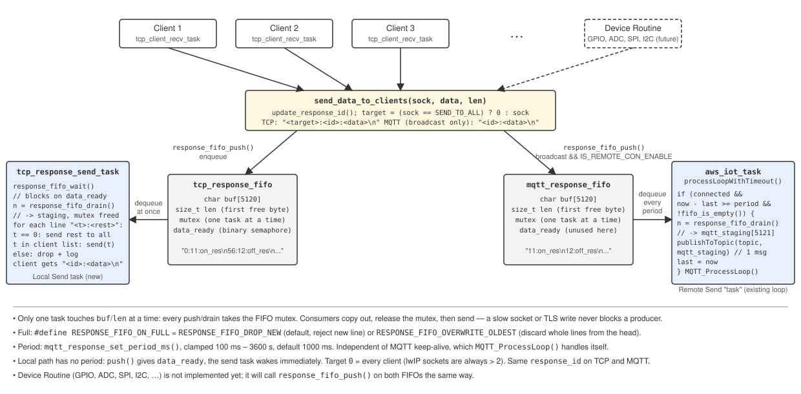
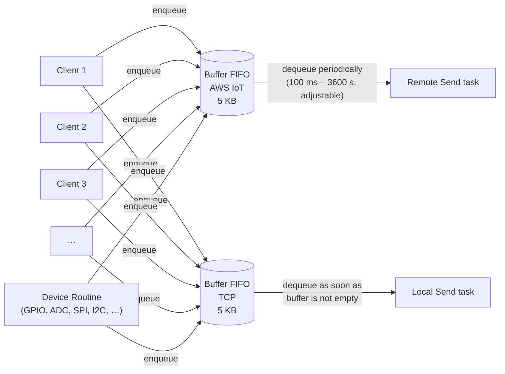

# Send buffers: local (TCP) and remote (AWS IoT) paths

Data flow for outgoing responses, implemented in
[src/common/response_fifo.c](../src/common/response_fifo.c) (the generic engine), with
the two instances next to their consumers:
[tcp_server/tcp_response_fifo.c](../src/tcp_server/tcp_response_fifo.c) and
[aws/mqtt_response_fifo.c](../src/aws/mqtt_response_fifo.c). Every producer — each
connected TCP client and (later) a device routine that samples peripherals —
pushes the same line into two independent FIFO buffers. One buffer feeds the
remote path (AWS IoT, drained on a timer), the other feeds the local path
(TCP, drained immediately). The two paths never block each other, and network
I/O never happens while a buffer is locked.

## Producers

| Producer | Source of data |
|---|---|
| `Client 1 … N` | One per accepted TCP connection (each `tcp_client_recv_task`, see [tcp-server.md](tcp-server.md)). Local commands are answered through [`send_data_to_clients(SEND_TO_ALL, …)`](../src/tcp_server/tcp_client_list.c); pairing ACKs and OTA step lines through [`send_raw_to_client(sock, text)`](../src/tcp_server/tcp_client_list.c), which pushes `"<sock>:<text>\n"` with no id and no MQTT mirror. |
| `Device Routine` | Not implemented yet. Periodic/event-driven sampling of peripherals — GPIO, ADC, SPI, I2C, … — will call `response_fifo_push()` on both FIFOs the same way. |

`send_data_to_clients(sock, data, len)` assigns a `response_id` and pushes:

| FIFO | Line stored | When |
|---|---|---|
| `tcp_response_fifo` | `"<sock>:<id>:<data>\n"` — `<sock>` is the target socket, or `RESPONSE_TARGET_ALL` (`0`) for every client (`SEND_TO_ALL`) | always |
| `mqtt_response_fifo` | `"<id>:<data>\n"` | broadcasts only, and only when `IS_REMOTE_CON_ENABLE` |

`0` is safe as "all" because lwIP sockets are always > 2 (0–2 are stdio).
The buffers are independent so a slow remote link never stalls local
delivery. Both TCP and MQTT carry the same id for the same event. One
response must be one line — `<data>` must not contain an embedded `\n`.

## The FIFO

`response_fifo_t` ([common/response_fifo.h](../src/common/response_fifo.h)) is a flat
`char buf[5120]` plus `len`, the index of the first free byte. Lines are
newline-terminated; `push()` appends a `'\n'` if the caller did not.

| Call | What it does |
|---|---|
| `response_fifo_push(f, data, len)` | Take mutex, append, release, then give `data_ready`. |
| `response_fifo_drain(f, out, cap)` | Take mutex, copy everything to `out`, `len = 0`, clear the bytes, release. The caller sends **after** the mutex is released. |
| `response_fifo_wait(f, ticks)` | Block until the FIFO is non-empty. |

**Full policy** — compile-time `RESPONSE_FIFO_ON_FULL`:

| Value | Behaviour when a line does not fit |
|---|---|
| `RESPONSE_FIFO_DROP_NEW` (default) | Reject the new line, log a warning, keep what is queued. |
| `RESPONSE_FIFO_OVERWRITE_OLDEST` | Discard whole lines from the head (never splits a line) until the new one fits. |

## Remote path (AWS IoT)

- **Commands:** payloads on `MQTT_COMMAND_TOPIC` go to `process_aws_iot_command()`
  ([aws/aws_iot_handler.c](../src/aws/aws_iot_handler.c)), which hands them to
  `app_mqtt_command_handle()` (declared in [CyThingEsp32.h](../src/CyThingEsp32.h),
  defined by the application: [app_main.c](../main/app_main.c) under ESP-IDF,
  the sketch under Arduino/PlatformIO — see [cy_thing_lib.md](cy_thing_lib.md)).
  This is the place for project-specific MQTT commands, so developers only
  need to edit that one file. Reply with `mqtt_publish_response()` (immediate, own id) or
  `send_data_to_clients(SEND_TO_ALL, ...)` (batched via the FIFO below and
  mirrored to TCP clients).
- **Buffer:** `mqtt_response_fifo`, 5 KB.
- **Consumer:** the "Remote Send task" in the diagram is the existing
  `aws_iot_task` — the drain lives in `processLoopWithTimeout()`
  ([aws/aws_iot_handler.c](../src/aws/aws_iot_handler.c)), not in a separate task,
  because coreMQTT's `MQTTContext_t` belongs to that task and is not
  thread-safe.
- **Period:** every `mqtt_response_get_period_ms()` (default 1000 ms,
  clamped to **100 ms – 3600 s** by `mqtt_response_set_period_ms()`, both in
  [aws/mqtt_response_fifo.c](../src/aws/mqtt_response_fifo.c)) the
  whole buffer is drained and published as **one MQTT message** on
  `MQTT_RESPONSE_TOPIC`. The check is tick-based and independent of the MQTT
  keep-alive; `MQTT_ProcessLoop()` returns within ~10 ms when idle
  (`CONFIG_MQTT_RECV_POLLING_TIMEOUT_MS`), so 100 ms is honoured.
- **Offline:** while MQTT is disconnected the FIFO fills up to 5 KB and then
  applies the full policy; the backlog is flushed on the first period after
  reconnect.

## Local path (TCP)

- **Buffer:** `tcp_response_fifo`, 5 KB.
- **Consumer:** `tcp_response_send_task` ([tcp_client_list.c](../src/tcp_server/tcp_client_list.c),
  sized in [common/task_config.h](../src/common/task_config.h)). It blocks on the FIFO's
  `data_ready` semaphore, so it runs **as soon as a line is pushed**, drains
  into a static staging buffer and walks it line by line:
  - parse the `<sock>:` prefix and strip it — clients receive `"<id>:<data>\n"`;
  - `0` → `send()` to every socket in `account_struct_list`;
  - other → `send()` to that socket **only if it is still in
    `account_struct_list`** (the client may have disconnected and lwIP may
    have reused the fd while the line was queued); otherwise the line is
    dropped with a warning;
  - a line without a numeric prefix is dropped with a warning, never
    misrouted.

## Concurrency

Multiple tasks push into each buffer, so **only one task may touch a buffer
at a time**: every access to `buf`/`len` goes through the FIFO's mutex. The
consumers copy out under the mutex and release it *before* `send()` /
`publishToTopic()`, so a slow socket or TLS write never blocks a producer.
Each buffer has a single reader.

Known gap (pre-existing): `account_struct_list` is modified by the TCP
server tasks and read by `tcp_response_send_task` without a lock.
