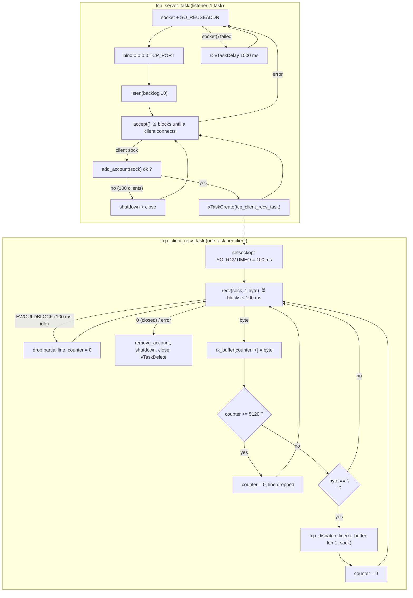
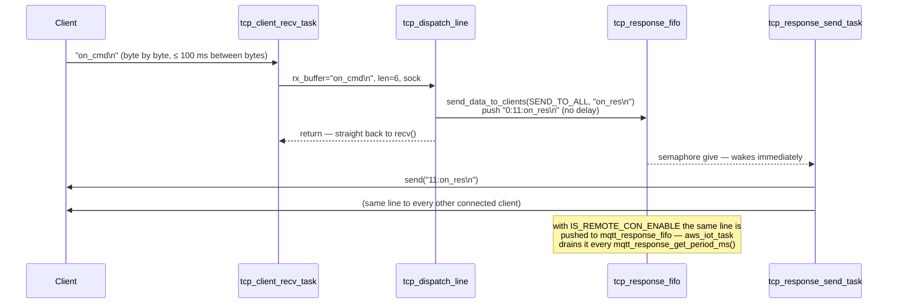

# TCP command server

The device exposes a small line-oriented TCP server on port **1234**. It is the
local (same-LAN) control channel used by the mobile app and tooling for:

- Wi-Fi pairing (hand the device the router SSID/password)
- per-device certificate provisioning (`REQID:` / `PROV:` / `CSRREQ` / … / `PFIN`)
- triggering an HTTPS OTA update
- local commands (`on_cmd` / `off_cmd`)

The same port number is also used by the UDP discovery server
([udp_socket/udp_server.c](../src/udp_socket/udp_server.c), write-up in
[udp-discovery.md](udp-discovery.md)), which only answers `GET_INFO` scans;
pairing is TCP-only.

All code lives in [src/tcp_server/](../src/tcp_server/):

| File | Role |
|---|---|
| `tcp_server.c` | listener task |
| `tcp_client_recv.c` | per-client receive task, line framing |
| `tcp_command.c` | `tcp_dispatch_line()`, HTTPS OTA handshake, local commands |
| `pairing.c` | Wi-Fi pairing state machine + timer ([pairing.md](pairing.md)) |
| `tcp_client_list.c` | client registry, response producers, TCP send task |

## Lifecycle at a glance

1. **Listen** – create a socket, bind `0.0.0.0:1234`, `listen()`.
2. **Accept** – block in `accept()`; on a new client, register it in the
   account list.
3. **Spawn a receive task** for that client (`tcp_client_recv_task`):
   1. `recv()` **one byte at a time** into a 5120-byte line buffer.
   2. When the byte just received is the suffix `"\n"`, hand the line to
      `tcp_dispatch_line()`.
4. The listener goes straight back to `accept()` for the next client.
   Each client keeps its own task until it disconnects or errors out.



Legend: ⏳ = blocking wait on I/O, ⏱ = explicit `vTaskDelay`. Every delay in
the TCP path is listed with its real value in
[Delays and timeouts](#delays-and-timeouts).

### Who starts the server

`tcp_server_task` is created with stack `TCP_SERVER_TASK_STACK_SIZE` (4096),
priority `TCP_SERVER_TASK_PRIORITY` (5) — both from [common/task_config.h](../src/common/task_config.h) — and `AF_INET` as its parameter, from one of three places depending
on the Wi-Fi mode:

| Situation | Where |
|---|---|
| Access-point (unpaired) mode, right after the soft-AP comes up | [cything.c:82](../src/cything.c:82) |
| Station mode, on `IP_EVENT_STA_GOT_IP` | [wifi/station_mode.c](../src/wifi/station_mode.c) |
| Station mode with `ENABLE_WIFI_STATIC_IP` | [wifi/station_mode.c](../src/wifi/station_mode.c) |

In station mode the `all_sockets_init` flag
([wifi/station_mode.c](../src/wifi/station_mode.c)) makes sure the server (and the
UDP server) are started only once even if the IP event fires again after a
reconnect.

## Step 1–2: listen and accept

[`tcp_server_task`](../src/tcp_server/tcp_server.c):

- `socket(AF_INET, SOCK_STREAM, IPPROTO_IP)`; on failure it sleeps 1 s and
  retries forever.
- `SO_REUSEADDR` is set so a restart can rebind immediately.
- `bind()` to `INADDR_ANY` / `TCP_PORT`
  ([device_config/device_config.h](../src/device_config/device_config.h)), `listen()` with backlog 10.
  Failures of `bind`/`listen` are only logged — the `goto CLEAN_UP` that would
  abort is commented out, so the task carries on into `accept()` regardless.
- Inner `while(1)` calls `accept()`. If `accept()` fails the inner loop breaks
  and the outer loop creates a **new** listening socket (the old descriptor is
  not closed).

On a successful accept:

1. With `TCP_SERVER_DB` on, the peer address is rendered with `inet_ntoa_r`
   and logged. It is not used for anything else.
2. The socket is registered with
   [`add_account(sock)`](../src/tcp_server/tcp_client_list.c). If the registry is
   full (100 clients) the connection is shut down and closed immediately
   ([tcp_server/tcp_server.c](../src/tcp_server/tcp_server.c)).
3. A **session slot** is acquired with
   [`local_session_acquire(sock, peer_ip)`](../src/security/local_session.h)
   — the per-connection framing count and local-link auth state
   ([local-auth.md](local-auth.md)). Pool full (8) → refused like a full
   registry.
4. A `tcp_client_recv_task` is spawned with a pointer to that slot. Slots
   never move, so the pointer stays valid for the life of the connection
   (`account_struct_list` is compacted on every disconnect, which is why it
   is not passed instead).
4. The listener immediately returns to `accept()`.

> Earlier versions extracted the last octet of the peer IP (`get_ip4()`) and
> only accepted clients with an octet `< 255`. The value was never read and
> the check could never fail for an IPv4 peer, so it was removed — first from
> the TCP path, then from the UDP server; `get_ip4()` itself is gone.

## Step 3: the per-client receive task

[`tcp_client_recv_task`](../src/tcp_server/tcp_client_recv.c) owns one socket for the
lifetime of that connection.

### Framing

| Setting | Value | Defined in |
|---|---|---|
| Line terminator | `"\n"` (`TCP_RECEIVE_DATA_SUFFIX`) | [tcp_server/tcp_client_recv.h](../src/tcp_server/tcp_client_recv.h) |
| Max line length | 5120 bytes (`TCP_RECEIVE_DATA_LENGTH`) | [tcp_server/tcp_client_recv.h](../src/tcp_server/tcp_client_recv.h) |
| Inter-byte timeout | 100 ms (`TCP_RECEIVE_TIMEOUT_MS`, via `SO_RCVTIMEO`) | [tcp_server/tcp_client_recv.h](../src/tcp_server/tcp_client_recv.h) |
| Read granularity | 1 byte per `recv()` (`CONSTANT_TCP_RECEIVE_LEN` is `#undef`) | [tcp_server/tcp_client_recv.h](../src/tcp_server/tcp_client_recv.h) |

The loop reads a single byte, appends it to `rx_buffer` and increments the
connection's `session->rx_len`, then decides:

| Condition | Action |
|---|---|
| `recv()` returned `-1` with `EWOULDBLOCK`/`EAGAIN` (100 ms passed with no byte) | The partial line is discarded (`counter = 0`), connection stays open. |
| `recv()` returned `-1` with any other errno | Leave the loop → connection torn down. |
| `recv()` returned `0` | Peer closed → leave the loop. |
| Counter reached 5120 | Buffer full: counter reset, the oversized line is silently dropped. |
| Last byte equals `"\n"` | `rx_buffer` is NUL-terminated; [`enc_frame_unwrap()`](../src/security/enc_frame.h) decrypts it in place if it is an `ENC:` frame (a bad frame is answered `ERR:ENC` and dropped); then `tcp_dispatch_line(rx_buffer, len, sock)`; counter reset; straight back to `recv()`. |

Note the length passed to `tcp_dispatch_line` **excludes** the `"\n"`, but the
newline is still present in the NUL-terminated string. The pairing parser
depends on it (`SET_ROUTER_SSID_SUFFIX` is `"\n"`), while the provisioning
handler strips it itself
([aws/provisioning.c](../src/aws/provisioning.c)).

### Teardown

When the loop exits for any reason the task:

1. [`local_session_release(sock)`](../src/security/local_session.h) — wipes
   the connection's keys and frees its slot;
2. [`remove_account(sock)`](../src/tcp_server/tcp_client_list.c) — drops the client
   from the broadcast list;
3. `shutdown()` + `close()` the socket;
4. `vTaskDelete(NULL)`.

## Step 3.2: command dispatch

[`tcp_dispatch_line`](../src/tcp_server/tcp_command.c) matches the line prefix in the
following order. The first handler that claims the line wins; a line no
handler claims is logged (`unrecognised line ignored`) and dropped.



There is no deliberate delay between receiving a line and queueing its
reply. The only waits on the request path are the socket ones (`accept`,
`recv`); the reply leaves as soon as `tcp_response_send_task` is scheduled.

### 0. Access policy, pairing, authentication, owner commands

Before any of the handlers below, [`access_policy_allow()`](../src/security/access_policy.h)
decides whether the line may run at all (with `LOCAL_AUTH_ENFORCE`, a
protected command from an un-paired socket is answered `ERR:AUTH`), then
the local-link security lines are tried: `PAKE1:`/`PAKE3:`
([pake_handler](../src/security/pake_handler.h)), `ENROLL:`/`AUTH1:`/`AUTH3:`
([local_auth](../src/security/local_auth.h)) and `LIST`/`REVOKE:`/`PWSET:`/`RESET`
([owner_commands](../src/security/owner_commands.h)). Their replies bypass
the response FIFO (`security_send_line`), like the provisioning handshake.
All of it is documented in [local-auth.md](local-auth.md).

### 1. Certificate provisioning

Lines starting with `REQID:`, `PROV:`, `CSRREQ`, `DEVID:`, `CERT:` or `PFIN`
are handed to
[`provisioning_handle_tcp_line()`](../src/aws/provisioning.c) and the
function returns. This is checked first because those prefixes are otherwise
unused. Replies are single lines sent on the same socket (`ACK`, `CLAIM:…`,
`CSR:…`, …); `PFIN` persists the identity and reboots. See
[aws/provisioning.h](../src/aws/provisioning.h) for the handshake.

### 2. HTTPS OTA

| Line | Response | Effect |
|---|---|---|
| `startupdatecomm` | `startupdateres\n` | none — handshake step |
| `credentialcomm` | `credentialres\n` | none — handshake step |
| `updatingcomm<https-url>` | `updating:2\n`, then `updating:<pct>\n` as it downloads, then `updatedres\n` | URL copied into `firmwareUrl`; [`ota_task`](../src/ota_lib/http_ota_handler.c:6) spawned (8192-byte stack). It streams progress back on the **same socket**, then reboots. |

Command/response strings come from the `updateFirmwareSteps[]` table in
[tcp_server/tcp_command.c](../src/tcp_server/tcp_command.c).

### 3. Wi-Fi pairing

Full write-up with block diagram: [pairing.md](pairing.md).

A four-step state machine driven by a file-static `pairing_step` in
[tcp_server/pairing.c](../src/tcp_server/pairing.c) (TCP only — the UDP
server no longer handles pairing). `tcp_dispatch_line` calls
`pairing_handle_line(line, sock)`, which returns true for any pairing
command. Each accepted step replies
`ACK\n`, advances the step and re-arms a one-shot inactivity timer
(`PAIRING_TIMEOUT_MS`, 6 s — see [tasks.md](tasks.md#software-timers)); if
the next step doesn't arrive in time the machine drops back to step 0. A
line for the wrong step is ignored (no reply), except `StartP`, which is
accepted at any step and restarts the flow.

| Step (`pairing_step`) | Expected line | Action |
|---|---|---|
| any | `StartP` | → 1, timer armed |
| 1 `SET_ROUTER_SSID_IND` | `ssid:<ssid>\n` | store SSID in `temp_ssid`, → 2 |
| 2 `SET_ROUTER_PASS_IND` | `pass:<password>\n` | store password in `temp_password`, → 3 |
| 3 `FINISH_PAIRING_IND` | `FinishP` | `flash_store_wifi_router_info(...)`, reply, `reboot_after_ms(1000)` into station mode; step → 0 |

Prefix/suffix validation is done by `is_pairing_command_valid()` (static in
`pairing.c`); the `ssid:`/`pass:` prefixes are in
[device_config/device_config.h](../src/device_config/device_config.h), and `StartP`/`FinishP`/`ACK` and the
step indices are private to `pairing.c`.

### 4. Local commands

`local_command_handle_line()` in [tcp_server/tcp_command.c](../src/tcp_server/tcp_command.c) — add new commands there:

| Line | Broadcast |
|---|---|
| `on_cmd` | `on_res\n` |
| `off_cmd` | `off_res\n` |

### 5. Application commands (`app_main.c`)

Anything not claimed above is passed to `app_command_handle_line()`, declared
in [CyThingEsp32.h](../src/CyThingEsp32.h) and defined by the application —
[app_main.c](../main/app_main.c) under ESP-IDF, the sketch under
Arduino/PlatformIO (see [cy_thing_lib.md](cy_thing_lib.md)). This is the place
for project-specific commands, so developers only need to edit that one file.
It receives the same `line`/`len`/`sock` as `tcp_dispatch_line`; return
`true` once handled.
Use `send_data_to_clients(SEND_TO_ALL, ...)` to broadcast (as `on_cmd` does)
or `send_raw_to_client(sock, ...)` to answer only the sender.

Anything else is logged as `unrecognised line ignored` and gets no reply.
Broadcast responses do **not** go back to
just the sender — see next section.

## Responses and broadcast

Every byte written to a TCP client goes through the TCP response FIFO and is
sent by `tcp_response_send_task` (see [send-buffers.md](send-buffers.md)).
Two producers feed it:

- **Application response** (local commands):
  [`send_data_to_clients(SEND_TO_ALL, data, len)`](../src/tcp_server/tcp_client_list.c)
  bumps `response_id` (rolls 10 → 254 → 10), pushes `"<sock>:<id>:<data>\n"`
  for the TCP send task — which delivers `"<id>:<data>\n"` to **every** socket
  in `account_struct_list` — and, with `IS_REMOTE_CON_ENABLE == 1`
  ([aws/aws_config.h](../src/aws/aws_config.h)), mirrors `"<id>:<data>\n"` into
  the MQTT FIFO for the AWS IoT task.
- **Protocol reply** (pairing ACKs, OTA step/progress lines):
  [`send_raw_to_client(sock, text)`](../src/tcp_server/tcp_client_list.c) pushes
  `"<sock>:<text>\n"` — no id, no MQTT mirror, one socket. The send task strips
  the `"<sock>:"` prefix, so the client receives `text` verbatim.

Both share one FIFO, so replies to the same client leave in the order they
were produced (e.g. `updating:2` before the `updating:N` progress lines from
`ota_task`), and a reply to a client that has since disconnected is dropped
by the send task instead of being `send()`-ed to a stale descriptor.

Certificate provisioning ([aws/provisioning.c](../src/aws/provisioning.c)) is the one
remaining direct sender: its `CLAIM:`/`CSR:` lines can exceed
`RESPONSE_LINE_MAX`, so its `send_line()` `send()`s from the receive task —
short replies from a 64-byte stack buffer, long ones as the text followed by
a separate `"\n"`.

So a client that sends `on_cmd` receives e.g. `11:on_res`, and so does every
other connected TCP client and any MQTT subscriber; a client that sends
`startpairing` receives `PAIR_ACK` and nobody else sees it.

## Client registry

[`account_struct_list[100]`](../src/tcp_server/tcp_client_list.c) is a plain array of
`{ sock }` with `account_list_size` as its length.

- `add_account` appends and returns `true`; when the list is full (100) it
  returns `false` and the listener closes the socket.
- `remove_account` finds the entry by socket and shifts the tail down by one.
- `send_data_to_clients(SEND_TO_ALL, …)` iterates the list.

## Delays and timeouts

Every place the TCP path blocks, sleeps or arms a timer, with the value
actually in effect (`CONFIG_FREERTOS_HZ=100`, so one tick is 10 ms and
`n / portTICK_PERIOD_MS` is **integer division by 10**).

| Where | Call | Nominal | Effective | Purpose |
|---|---|---|---|---|
| `tcp_server_task` | `vTaskDelay(1000 / portTICK_PERIOD_MS)` after `socket()` fails | 1000 ms | 100 ticks = 1 s | back-off before retrying socket creation |
| `tcp_server_task` | `accept()` | — | blocks until a client connects | — |
| `tcp_client_recv_task` | `recv(sock, 1 byte)` with `SO_RCVTIMEO = TCP_RECEIVE_TIMEOUT_MS` | 100 ms | 100 ms | inter-byte timeout; on expiry a partial line is discarded and the connection kept |
| `tcp_response_send_task` | `response_fifo_wait(&tcp_response_fifo, portMAX_DELAY)` | ∞ | until a producer pushes | wakes on every push |
| `send_data_to_clients` / `send_raw_to_client` | `xSemaphoreTake(fifo mutex, portMAX_DELAY)` inside `response_fifo_push` | ∞ | microseconds (memcpy under the lock) | serialises producers |
| `update_response_id` | `xSemaphoreTake(response_id_mutex, portMAX_DELAY)` | ∞ | microseconds | one id per response |
| `pairing.c` | `pairing_timer` — FreeRTOS one-shot, `PAIRING_TIMEOUT_MS` | 6 s | 600 ticks = 6 s | resets `pairing_step` if the next step never arrives; re-armed on every accepted step |
| `pairing.c` `FinishP` | `reboot_after_ms(1000)` | 1 s | 1 s (`esp_timer`, µs resolution) | lets the `ACK` leave before `esp_restart()` |
| `aws/provisioning.c` `PFIN` | `reboot_after_ms(1000)` | 1 s | 1 s | same |
| `ota_task` after `updatedres` | `reboot_after_ms(2000)` | 2 s | 2 s | same, plus flash settle |
| `esp_https_ota_perform` loop | HTTP client timeouts (`esp_http_client_config_t`) | IDF defaults | IDF defaults | download; progress lines are queued as it goes |

Things worth knowing that follow from the table:

- **The receive task never sleeps.** After dispatching a line it goes
  straight back to `recv()`. (It used to call
  `vTaskDelay(5 / portTICK_PERIOD_MS)` here, which at a 10 ms tick is
  integer-division-to-zero — `vTaskDelay(0)`, a bare yield — and was
  removed as doing nothing useful.)
- **The reply path has no sleep at all.** A response reaches the socket as
  soon as `tcp_response_send_task` (priority 5, same as the client tasks) is
  scheduled after the push. A client task and the send task share priority
  5, so the reply goes out at the next scheduling point after the client
  task blocks in `recv()`.
- **The 100 ms inter-byte timeout is per byte, not per line.** A client can
  take as long as it likes to send a line as long as no two bytes are more
  than 100 ms apart. A line stalled longer than that is silently discarded
  and the next bytes start a fresh line.
- **Reboots are never blocking.** `reboot_after_ms()` arms an `esp_timer`
  and returns; the calling task goes straight back to `recv()`.

## Configuration knobs

| Macro | Default | Where | Meaning |
|---|---|---|---|
| `TCP_PORT` | `1234` | [device_config/device_config.h](../src/device_config/device_config.h) | listening port |
| `TCP_RECEIVE_DATA_LENGTH` | `5120` | [tcp_server/tcp_client_recv.h](../src/tcp_server/tcp_client_recv.h) | max line length incl. `\n` |
| `TCP_RECEIVE_DATA_SUFFIX` / `_LENGTH` | `"\n"` / `1` | [tcp_server/tcp_client_recv.h](../src/tcp_server/tcp_client_recv.h) | line terminator |
| `TCP_RECEIVE_TIMEOUT_MS` | `100` | [tcp_server/tcp_client_recv.h](../src/tcp_server/tcp_client_recv.h) | inter-byte `SO_RCVTIMEO` |
| `TCP_SERVER_TASK_STACK_SIZE` / `TCP_SERVER_RECV_TASK_STACK_SIZE` | `4096` / `10240` | [common/task_config.h](../src/common/task_config.h) | stack for the listener / for each client task; the client stack holds `rx_buffer[TCP_RECEIVE_DATA_LENGTH]` plus ~3.5 KB of call chain, so it must grow with the line length |
| `CONSTANT_TCP_RECEIVE_LEN` | undefined | [tcp_server/tcp_client_recv.h](../src/tcp_server/tcp_client_recv.h) | if defined, read fixed `TCP_RECEIVE_DATA_LENGTH`-byte blocks instead of lines (that path references an undeclared `sock` and does not currently compile) |
| `TCP_SERVER_DB` | `1` | [common/cy_log.h](../src/common/cy_log.h) | `0`/`1` switch for the server's `CY_LOGx(TCP_SERVER_DB, …)` tracing; `0` compiles the logs out |
| `SEND_TO_ALL` | `-2` | [tcp_server/tcp_client_list.h](../src/tcp_server/tcp_client_list.h) | sentinel socket for broadcast |

## Trying it

With the device on the same network (or connected to its soft-AP):

```bash
nc <device-ip> 1234
```

```
on_cmd            ← you type (terminated by Enter)
11:on_res         ← device broadcasts
off_cmd
12:off_res
```

Lines must arrive with less than 100 ms between bytes; pasting or scripted
sends are fine, typing slowly one character at a time is not.

## Known limitations

Current behaviour, documented rather than fixed:

- **Unlocked shared globals.** `pairing_step` is written by every client
  task and the pairing timer callback, `firmwareUrl` by the TCP and OTA
  tasks, with no mutex.
- **Listener leaks on accept failure.** The old listening descriptor is not
  closed before a new one is created.
- **Over-long values are silently truncated.** `updatingcomm<url>` is clamped
  to `firmwareUrl[4096]` and `ssid:`/`pass:` to `temp_ssid[128]` /
  `temp_password[128]` rather than rejected; the truncated value is stored
  and ACKed.
- **Silent drops.** Oversized lines (≥5120 bytes) and lines interrupted by the
  100 ms timeout are discarded with no reply.

Fixed: the global framing counter and the task parameter that aliased the
compacting `account_struct_list` — both replaced by the per-socket session
slot ([local-auth.md](local-auth.md), "Modules").

## File map

| File | Role |
|---|---|
| [src/tcp_server/tcp_server.c](../src/tcp_server/tcp_server.c) | listener task |
| [src/tcp_server/tcp_client_recv.c](../src/tcp_server/tcp_client_recv.c) | per-client receive task, framing; `TCP_RECEIVE_*` tunables in its header |
| [src/tcp_server/tcp_command.c](../src/tcp_server/tcp_command.c) | `tcp_dispatch_line`, `updateFirmwareSteps[]`, local commands |
| [src/tcp_server/pairing.c](../src/tcp_server/pairing.c) | Wi-Fi pairing state machine, timer, validation |
| [src/tcp_server/tcp_client_list.c](../src/tcp_server/tcp_client_list.c) | client list, `send_data_to_clients` / `send_raw_to_client`, TCP send task |
| [src/security/](../src/security/) | per-socket session slot, password pairing, per-phone keys, `ENC:` framing, access policy — [local-auth.md](local-auth.md) |
| [src/aws/provisioning.c](../src/aws/provisioning.c) | certificate provisioning line handler |
| [src/udp_socket/udp_server.c](../src/udp_socket/udp_server.c) | UDP discovery server (`GET_INFO` only) |
| [src/ota_lib/http_ota_handler.c](../src/ota_lib/http_ota_handler.c) | `ota_task` (HTTPS OTA with progress on the TCP socket) |
| [src/device_config/device_config.h](../src/device_config/device_config.h) | `TCP_PORT`, pairing prefixes |
| [src/aws/aws_config.h](../src/aws/aws_config.h) | `IS_REMOTE_CON_ENABLE` |
| [src/wifi/station_mode.c](../src/wifi/station_mode.c), [src/cything.c](../src/cything.c) | where the server task is started |
