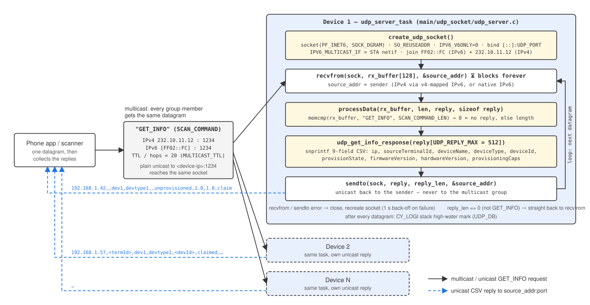
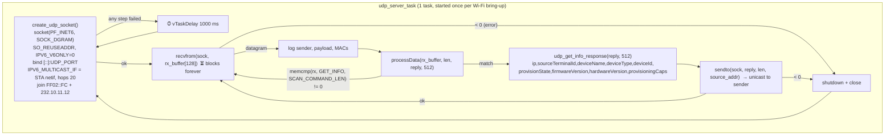

# UDP discovery server (multicast `GET_INFO`)

The device runs a small UDP server on port **1234** whose only job is
**discovery**: the mobile app sends one `GET_INFO` datagram to a multicast
group, every device on the LAN that has joined the group receives it, and
each one answers with a **unicast** CSV line describing itself (IP, name,
type, provisioning identity, versions). That is how the app builds its device
list without knowing any device's IP in advance.

> **Per-channel config (2026-09):** the UDP port, discovery multicast group and `GET_INFO` token are runtime values now — `cy_udp_port`, `cy_multicast_ipv4`, `cy_scan_command` (`device_config/cy_config.h`), overridable per channel by the sketch the app exports. The macros in `device_config.h` remain only as their weak defaults.

The same port number is used by the [TCP command server](tcp-server.md);
everything else (pairing, provisioning, OTA, `on_cmd`/`off_cmd`) is TCP-only.
The UDP server answers `GET_INFO` and ignores every other payload.

All code lives in [src/udp_socket/](../src/udp_socket/):

| File | Role |
|---|---|
| `udp_server.c` | `udp_server_task`: socket setup, multicast joins, receive/reply loop, `processData()` |
| `udp_response_handler.c` | `udp_get_info_response()`: formats the 9-field scan reply |



## Lifecycle at a glance

1. **Create the socket** – one dual-stack IPv6 UDP socket bound to
   `[::]:1234`, joined to the IPv6 group `FF02::FC` and the IPv4 group
   `232.10.11.12`. If any step fails, sleep 1 s and start over.
2. **Wait** – block in `recvfrom()`; a datagram sent to either group *or*
   directly to the device's own address lands here.
3. **Match** – `processData()` compares the payload with `SCAN_COMMAND`
   (`"GET_INFO"`). Anything else produces no reply.
4. **Format** – `udp_get_info_response()` builds the CSV line into a
   512-byte `reply` buffer.
5. **Reply** – `sendto()` the line to `source_addr`, i.e. **back to the
   sender only**, never to the multicast group. Then straight back to step 2.



Legend: ⏳ = blocking wait on I/O, ⏱ = explicit `vTaskDelay`. Every wait in
the UDP path is listed with its real value in
[Delays and timeouts](#delays-and-timeouts).

### Who starts the server

`udp_server_task` is created with stack `UDP_SERVER_TASK_STACK_SIZE` (4096),
priority `UDP_SERVER_TASK_PRIORITY` (5) — both from
[common/task_config.h](../src/common/task_config.h) — and `AF_INET` as its
(unused) parameter, from the same three places as the TCP server:

| Situation | Where |
|---|---|
| Access-point (unpaired) mode, right after the soft-AP comes up | [cything.c:81](../src/cything.c:81) |
| Station mode, on `IP_EVENT_STA_GOT_IP` | [wifi/station_mode.c:104](../src/wifi/station_mode.c:104) |
| Station mode with `ENABLE_WIFI_STATIC_IP` | [wifi/station_mode.c:64](../src/wifi/station_mode.c:64) |

In station mode the `all_sockets_init` flag makes sure the task is created
only once even if the got-IP event fires again after a reconnect. The task
itself never exits: on any socket error it closes and recreates the socket.

## Step 1: socket setup

[`create_udp_socket()`](../src/udp_socket/udp_server.c) builds one socket that
receives IPv4 *and* IPv6, multicast *and* unicast:

| Call | Value | Why |
|---|---|---|
| `socket(PF_INET6, SOCK_DGRAM, IPPROTO_IPV6)` | — | one descriptor for both address families |
| `SO_REUSEADDR` | `1` | a restart (after an error) can rebind `:1234` immediately |
| `IPV6_V6ONLY` | `0` | **dual-stack**: IPv4 senders show up as v4-mapped IPv6 addresses (`::ffff:a.b.c.d`) |
| `bind()` | `[::]:UDP_PORT` (1234) | listen on every interface; port shared with TCP (different protocol, no clash) |
| `IPV6_MULTICAST_IF` | `esp_netif_get_netif_impl_index(p_netif_sta)` | pin multicast to the station interface |
| `IPV6_MULTICAST_HOPS` | `MULTICAST_TTL` (20) | hop limit for anything *sent* to a group — irrelevant in practice, replies are unicast |
| `IPV6_ADD_MEMBERSHIP` | `FF02::FC` on the STA netif | join the link-local IPv6 group (`socket_add_multicast_ipv6_group`) |
| `IP_ADD_MEMBERSHIP` | `232.10.11.12` on `INADDR_ANY` | join the IPv4 group (`socket_add_ipv4_multicast_group`) |

Both `socket_add_*_group` helpers validate the literal with `inet_aton` /
`inet6_aton` and warn if it is not a multicast address, but that can only
trip if someone edits the `#define`s.

Any failure in the chain (`socket`, `bind`, netif index, either group join)
closes the descriptor, and the task retries from scratch after 1 s.

> The netif index comes from `p_netif_sta`, which is only created by
> `wifi_init_sta()`. See [Known limitations](#known-limitations) for what that
> means in access-point mode.

## Step 2: receive

The inner `while(1)` in
[`udp_server_task`](../src/udp_socket/udp_server.c) calls
`recvfrom(sock, rx_buffer, 127, 0, &source_addr, &socklen)` with **no
receive timeout** — it blocks until a datagram arrives.

| Item | Value |
|---|---|
| `rx_buffer` | 128 bytes; a longer datagram is cut to 127 bytes (UDP semantics — the rest is dropped) |
| `source_addr` | `struct sockaddr_storage`; holds either a `sockaddr_in` or `sockaddr_in6`, and is passed back unchanged to `sendto()` |
| `addr_str` | the sender rendered with `inet_ntoa_r` / `inet6_ntoa_r`, used only for the log line |

On every datagram, with `UDP_DB` enabled
([common/cy_log.h](../src/common/cy_log.h)), the task logs the sender, the
payload, the base and eFuse MAC addresses, and — after `processData()` —
its own stack high-water mark. That last line is the figure to use when
re-tuning `UDP_SERVER_TASK_STACK_SIZE` (see [tasks.md](tasks.md)).

`recvfrom()` returning `< 0` breaks the inner loop: the socket is shut down,
closed and recreated by the outer loop.

## Step 3: matching the command

[`processData()`](../src/udp_socket/udp_server.c):

```c
if (memcmp(rx_buffer, SCAN_COMMAND, SCAN_COMMAND_LEN) == 0)
    return udp_get_info_response(reply, reply_size);
return 0;
```

| Macro | Value | Where |
|---|---|---|
| `SCAN_COMMAND` | `"GET_INFO"` | [device_config/device_config.h](../src/device_config/device_config.h) |
| `SCAN_COMMAND_LEN` | `sizeof(SCAN_COMMAND) - 3` = **6** | same |

Two things follow from that definition:

- It is a **prefix** match, not an equality: `GET_INFO`, `GET_INFO\n`,
  `GET_INFO?anything` all match, so a trailing newline from a shell tool is
  harmless.
- Because the length is `sizeof - 3` rather than `sizeof - 1`, only the first
  six bytes (`GET_IN`) are compared. `GET_INX` matches too. Nothing in the app
  depends on this; it is listed under
  [Known limitations](#known-limitations).

A return of `0` means *no reply*: the task goes straight back to `recvfrom()`
without sending anything, so unknown payloads are silently ignored.

## Step 4: the reply

[`udp_get_info_response()`](../src/udp_socket/udp_response_handler.c)
formats one comma-separated line, **no trailing newline**, into `reply`
(`UDP_REPLY_MAX` = 512 bytes, [udp_socket/udp_server.h](../src/udp_socket/udp_server.h)):

```
ip,sourceTerminalId,deviceName,deviceType,deviceId,provisionState,firmwareVersion,hardwareVersion,provisioningCaps
```

| # | Field | Source | Example |
|---|---|---|---|
| 1 | `ip` | `device_ip` ([wifi/wifi_info_handler.c](../src/wifi/wifi_info_handler.c)), updated when the soft-AP starts and on every got-IP event | `192.168.1.42` |
| 2 | `sourceTerminalId` | `g_prov_source_terminal_id` via `provisioning_get_scan_fields()`; **empty until provisioned** | `` / `<id>` |
| 3 | `deviceName` | `DEVICE_NAME` ([device_config.h](../src/device_config/device_config.h)) | `dev1` |
| 4 | `deviceType` | `DEVICE_TYPE` (must be lowercase — matched by the app) | `devtype1` |
| 5 | `deviceId` | `g_prov_device_id`; **empty until provisioned** | `` / `<id>` |
| 6 | `provisionState` | `"claimed"` once a CSR handshake has completed, else `"unprovisioned"` ([aws/provisioning.c](../src/aws/provisioning.c)) | `unprovisioned` |
| 7 | `firmwareVersion` | `FIRMWARE_VERSION` | `1.0` |
| 8 | `hardwareVersion` | `HARDWARE_VERSION` | `1.0` |
| 9 | `provisioningCaps` | `"claim"` if a claim certificate is flashed (`claim_cert_pem[0] != '\0'`, [aws/claim_credentials.h](../src/aws/claim_credentials.h)), else empty | `claim` |

So a fresh, unprovisioned unit with claim material replies:

```
192.168.1.42,,dev1,devtype1,,unprovisioned,1.0,1.0,claim
```

and the same unit after provisioning:

```
192.168.1.42,<sourceTerminalId>,dev1,devtype1,<deviceId>,claimed,1.0,1.0,claim
```

Field 9 tells the app whether it may run the `REQID:`/`CLAIM:`
claim-attestation step over TCP; fields 2/5/6 tell it whether this device
already belongs to an account. An unprovisioned reply is deliberately *not*
recognised by the app's general device list — only the "add a device" flow
acts on it (see the module comment in
[aws/provisioning.h](../src/aws/provisioning.h)).

If the line would not fit in 512 bytes it is truncated and a warning is
logged; with the current field sizes (IP + two 40-byte ids + short
constants) the worst case is ~200 bytes, so this does not happen.

## Step 5: sending

```c
sendto(sock, reply, reply_len, 0, (struct sockaddr *)&source_addr, sizeof(source_addr));
```

The reply goes to exactly the address and port the request came from —
**unicast**, even when the request was multicast. The app therefore has to
listen on the port it sent from; it receives one datagram per device, and
devices never see each other's replies.

Because the socket is dual-stack, an IPv4 scanner gets an IPv4 reply (lwIP
unmaps the v4-mapped address) and an IPv6 scanner gets an IPv6 reply.

A `sendto()` error breaks the inner loop, the same as a receive error: the
socket is closed and recreated.

## Delays and timeouts

Every place the UDP path blocks or sleeps, with the value actually in effect
(`CONFIG_FREERTOS_HZ=100`, so one tick is 10 ms).

| Where | Call | Nominal | Effective | Purpose |
|---|---|---|---|---|
| `udp_server_task` | `vTaskDelay(1000 / portTICK_PERIOD_MS)` after `create_udp_socket()` fails | 1000 ms | 100 ticks = 1 s | back-off before retrying socket creation |
| `udp_server_task` | `recvfrom()` (no `SO_RCVTIMEO`) | — | blocks until a datagram arrives | — |
| `udp_server_task` | `sendto()` | — | returns immediately (datagram queued to lwIP) | — |

There is no deliberate delay anywhere on the request/reply path: a reply
leaves as soon as `udp_get_info_response()` returns. The task never yields
between datagrams except by blocking in `recvfrom()`.

## Configuration knobs

| Macro | Default | Where | Meaning |
|---|---|---|---|
| `UDP_PORT` | `1234` | [device_config/device_config.h](../src/device_config/device_config.h) | bound port; the app must send to it |
| `SCAN_COMMAND` / `SCAN_COMMAND_LEN` | `"GET_INFO"` / `6` | same | request payload and compared prefix length |
| `DEVICE_NAME` / `DEVICE_TYPE` | `"dev1"` / `"devtype1"` | same | reply fields 3 and 4 |
| `FIRMWARE_VERSION` / `HARDWARE_VERSION` | `"1.0"` / `"1.0"` | same | reply fields 7 and 8 |
| `MULTICAST_IPV4_ADDR` | `232.10.11.12` | [udp_socket/udp_server.c](../src/udp_socket/udp_server.c) | IPv4 group joined; the app must send to it |
| `MULTICAST_IPV6_ADDR` | `FF02::FC` | same | IPv6 (link-local scope) group joined |
| `MULTICAST_TTL` | `20` | same | `IPV6_MULTICAST_HOPS`; only affects datagrams the device would *send* to a group (it sends none) |
| `UDP_REPLY_MAX` | `512` | [udp_socket/udp_server.h](../src/udp_socket/udp_server.h) | reply buffer on the task stack |
| `UDP_SERVER_TASK_STACK_SIZE` / `_PRIORITY` | `4096` / `5` | [common/task_config.h](../src/common/task_config.h) | stack holds `rx_buffer[128] + addr_str[128] + reply[512]` plus the `CY_LOGI` printf chain |
| `UDP_DB` | `1` | [common/cy_log.h](../src/common/cy_log.h) | `0`/`1` switch for the server's `CY_LOGx(UDP_DB, …)` tracing |

Changing `MULTICAST_IPV4_ADDR`, `UDP_PORT` or `SCAN_COMMAND` is a protocol
change: the app has to be updated in step.

## Trying it

From a machine on the same Wi-Fi as a paired (station-mode) device.

Multicast scan — every device on the LAN answers:

```bash
echo -n GET_INFO | socat -t 2 - UDP4-DATAGRAM:232.10.11.12:1234
```

Direct (unicast) query of one device:

```bash
echo -n GET_INFO | nc -u -w 1 <device-ip> 1234
```

Or from Python, which also shows which address each reply came from:

```python
import socket
s = socket.socket(socket.AF_INET, socket.SOCK_DGRAM)
s.settimeout(2)
s.sendto(b"GET_INFO", ("232.10.11.12", 1234))
try:
    while True:
        data, addr = s.recvfrom(512)
        print(addr, data.decode())
except socket.timeout:
    pass
```

Expected output, one line per device:

```
('192.168.1.42', 1234) 192.168.1.42,,dev1,devtype1,,unprovisioned,1.0,1.0,claim
```

On the device monitor you will see `Received 8 bytes from <ip>:`, the
payload, the two MAC lines, `udp_get_info_response`, the reply, and the
stack high-water mark.

If nothing comes back from a multicast scan but a unicast query works, the
access point is dropping multicast (common on guest networks and some
mesh systems) — the device is fine.

## Known limitations

Current behaviour, documented rather than fixed:

- **Not started in access-point mode.** `create_udp_socket()` needs the
  netif index of `p_netif_sta`, which is only created by `wifi_init_sta()`.
  In AP mode ([cything.c:81](../src/cything.c:81)) that pointer is `NULL`,
  `esp_netif_get_netif_impl_index()` returns `-1`, and the task logs
  `Failed to get netif index` and retries every second — so discovery only
  works once the device is paired and in station mode. The soft-AP address
  is fixed (`192.168.4.1`), so the app does not need discovery there.
- **Six-byte prefix match.** `SCAN_COMMAND_LEN` is `sizeof("GET_INFO") - 3`,
  so any payload starting with `GET_IN` is treated as a scan.
- **No authentication or rate limiting.** Anyone on the LAN can query the
  device's name, type, provisioning ids and versions as often as they like.
  Each request costs one `snprintf` and one `sendto`.
- **Errors tear down the socket.** A single failed `sendto()` (e.g. the
  scanner vanished and lwIP reports it) closes and recreates the socket
  rather than just skipping that reply. Harmless — the rebuild takes
  milliseconds — but it shows up in the log as
  `Shutting down socket and restarting...`.
- **`IPV6_MULTICAST_HOPS` result is not checked.** The `if (err < 0)` after
  that `setsockopt` tests the *previous* call's `err`, so a failure there
  would go unnoticed. It cannot fail on lwIP with a valid socket.
- **Verbose per-packet logging.** Every datagram produces ~7 log lines
  including both MAC addresses, which are constant. Set `UDP_DB` to `0` to
  silence them.
- **Dead code.** `test_udp_multicast_loopback()` in `udp_server.c` is an
  old send-and-receive self-test that is compiled but never called.

## File map

| File | Role |
|---|---|
| [src/udp_socket/udp_server.c](../src/udp_socket/udp_server.c) | `udp_server_task`, `create_udp_socket`, group joins, `processData` |
| [src/udp_socket/udp_server.h](../src/udp_socket/udp_server.h) | `UDP_REPLY_MAX`, task prototype |
| [src/udp_socket/udp_response_handler.c](../src/udp_socket/udp_response_handler.c) | `udp_get_info_response` — the 9-field CSV |
| [src/aws/provisioning.c](../src/aws/provisioning.c) | `provisioning_get_scan_fields` — fields 2, 5, 6 |
| [src/aws/claim_credentials.h](../src/aws/claim_credentials.h) | `claim_cert_pem` — decides field 9 |
| [src/wifi/wifi_info_handler.c](../src/wifi/wifi_info_handler.c) | `device_ip` — field 1 |
| [src/device_config/device_config.h](../src/device_config/device_config.h) | `UDP_PORT`, `SCAN_COMMAND`, name/type/version constants |
| [src/common/task_config.h](../src/common/task_config.h) | task stack and priority |
| [src/wifi/station_mode.c](../src/wifi/station_mode.c), [src/cything.c](../src/cything.c) | where the task is started |
